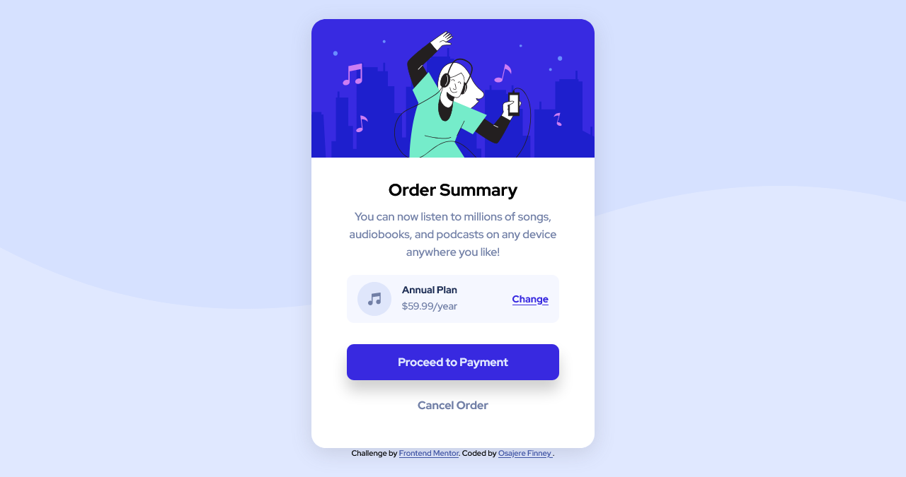

# Frontend Mentor - Order summary card solution

This is a solution to the [Order summary card challenge on Frontend Mentor](https://www.frontendmentor.io/challenges/order-summary-component-QlPmajDUj). Frontend Mentor challenges help you improve your coding skills by building realistic projects.

## Table of contents

- [Overview](#overview)
  - [The challenge](#the-challenge)
  - [Screenshot](#screenshot)
  - [Links](#links)
- [My process](#my-process)
  - [Built with](#built-with)
  - [What I learned](#what-i-learned)
- [Author](#author)
- [Acknowledgments](#acknowledgments)

## Overview

### The challenge

Users should be able to:

- See hover states for interactive elements

### Screenshot

### Desktop Design Screenshot

### Mobile Design Screenshot

### Links

- Solution URL: [Solution](https://www.frontendmentor.io/challenges/order-summary-component-QlPmajDUj/hub/responsive-order-summary-card-BydkPZeH9)
- Live Site URL: [Live Site](https://finney06.github.io/order-summary/)

## My process

### Built with

- Semantic HTML5 markup
- CSS custom properties
- Flexbox

## Author
- Frontend Mentor - [@Finney06](https://www.frontendmentor.io/profile/Finney06)
- Twitter - [@Osa_finney](https://www.twitter.com/@Osa_finney)
- Github - [@finney06](https://github.com/Finney06)

## Acknowledgement

All glory to God.